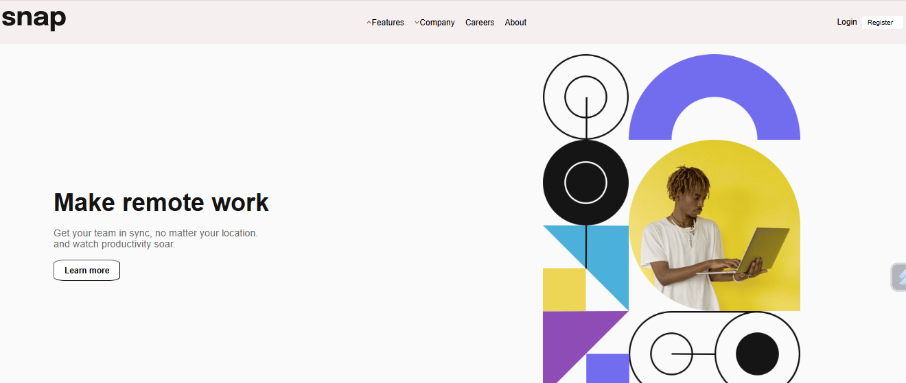
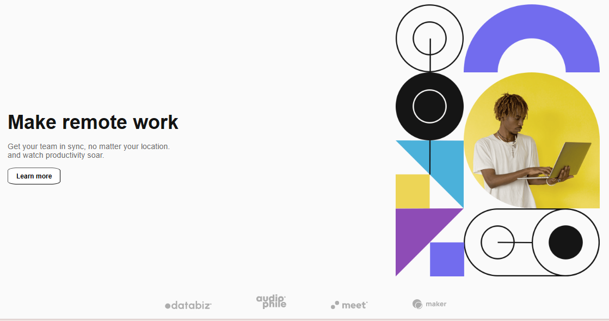

# Frontend Mentor - Intro Section with Dropdown Navigation

This project is a solution to the Frontend Mentor challenge. It involves building a simple intro section with a dropdown navigation menu using only HTML and CSS. The goal was to create a responsive, user-friendly design for both desktop and mobile views.

## Table of Contents

- Overview
  - Challenge
  - Screenshot
  - Links
- My Process
  - Built With
  - What I Learned
  - Continued Development
- Author

## Overview

### Challenge

The challenge was to build an intro section with a dropdown navigation menu using HTML and CSS. The navigation menu had to be responsive, adapting well to different screen sizes and providing a smooth user experience.

### Screenshot

### Links

- [Solution](#) 
- [Live Site](#)

## My Process

### Built With

- HTML5
- CSS3 (Flexbox and Grid)
- Mobile-first workflow

### What I Learned

This project helped me enhance my skills in responsive design using only HTML and CSS. I focused on creating a layout using Flexbox and Grid to structure the page, while ensuring the dropdown navigation was styled effectively using only CSS.

I also learned how to design the dropdown navigation for mobile using CSS, by toggling the menu visibility with CSS classes based on viewport size.

### Continued Development

In future projects, I plan to:

- Improve the design by adding CSS transitions for a smoother dropdown menu interaction.
- Experiment with different layout strategies to handle larger projects.

## Author

- Frontend Mentor - [@Siphe23](https://www.frontendmentor.io/profile/@Siphe23)
